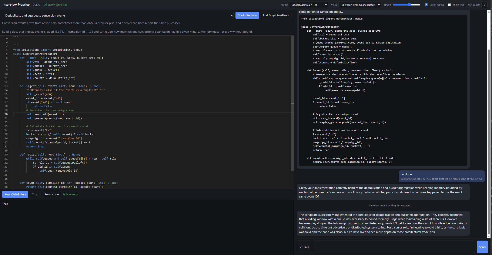

# Interview Practice

A voice mock-interview app: a Python editor you can run, and a local model (through LM Studio) that acts as the interviewer and sees your code and its output.



## Run it

1. In LM Studio, load a model and start the local server (Developer tab).
2. Start the app:

   ```bash
   python server.py
   ```

3. Open http://localhost:8765 in Chrome or Edge.

### If LM Studio asks for an API key

If the header shows "LM Studio not connected" with a 401 message, either turn off the API key requirement in LM Studio's server settings, or save your key in a file named `lmstudio_key.txt` in this folder (or set the `LMSTUDIO_API_KEY` environment variable) and restart `server.py`.

## Use it

- Pick a problem and press **Start interview**.
- Hold **V** to talk and release to send. V only works as push-to-talk while you are not typing in the editor or the message box; click **Push to talk** in the header to pick another key (a function key such as F9 works everywhere).
- Or press **Talk** (or Ctrl+M), speak, then press it again to send. Talking cuts the interviewer off mid-sentence.
- **Run** (Ctrl+Enter) executes your code in the browser. Runs are stopped after 10 seconds.
- **Run tests** (Ctrl+Shift+Enter) runs your code and then the tests, printing PASS, FAIL or ERROR for each. The tests live in the **Tests** tab next to **Code**, where you can read, edit and add to them. The built-in ones expect the names used in the starter code. If you change the tests, the interviewer sees them too.
- **End & get feedback** asks the interviewer for an assessment.
- Your code is saved per problem in the browser.

## How it works

| Part | Where it runs |
|---|---|
| Interviewer model | LM Studio on your machine, reached through `server.py` at `/lm/*` |
| Python execution | Pyodide (Python in WebAssembly) in a browser web worker |
| Speech to text | The browser's speech recognition. In Chrome this sends audio to Google |
| Text to speech | The browser's built-in voices |

The editor and Pyodide load from public CDNs, so the first load needs internet.

Every message to the model carries the system prompt, the recent conversation, your current editor contents and the last run's output. Set the model's context length in LM Studio to 8k tokens or more.

## Files

- `server.py`: static file server plus proxy to LM Studio
- `app.js`: editor, runner, chat, voice
- `problems.js`: the problem bank; add your own here
- `tests.js`: the assert tests for each problem, and the runner that reports them
- `py-worker.js`: runs Python off the main thread
